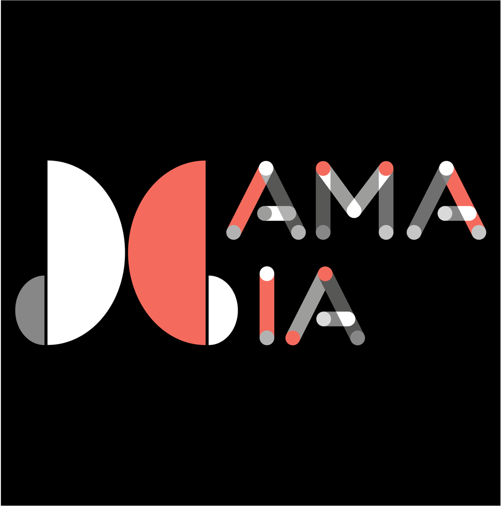

# MAMA: Challenges for diagnosis and treatment of Breast Cancer 🌸

Welcome to the MAMA Challenges! We are dedicated to advancing breast cancer research through open-source code, high-quality datasets, and reproducible AI benchmarks. 🚀

## 🏆 Highlight: The MAMA-MIA Challenge @ MICCAI 2025 📢

We are proud to showcase the MAMA-MIA Challenge, originally featured at MICCAI 2025! This challenge focuses on large-scale multicenter breast cancer DCE-MRI analysis.

### Challenge Features:

-  **The Dataset:** 1,506 cases of breast cancer DCE-MRI with expert segmentations. Find the dataset [here](https://www.synapse.org/Synapse:syn60868042/wiki/628716).

-  **Two Tasks:** Automated tumor segmentation and treatment response prediction.

-  **Evaluation:** Validated on private multicenter datasets of 572 patients to ensure real-world robustness and fairness across subgroups.

-  Explore the data and challenge repository here: [LidiaGarrucho/MAMA-MIA](https://github.com/LidiaGarrucho/MAMA-MIA)

-  Submit your algorithms to our running long-term benchmark for comparison: [Codabench](https://www.codabench.org/competitions/7425/)

  
  
  

## 🤖 Upcoming Challenge: MAMA-SYNTH in 2026🧪
Virtual Contrast-Enhanced Breast MRI Synthesis

We are thrilled to announce MAMA-SYNTH, a challenge dedicated to the future of contrast-free breast imaging.

### Why MAMA-SYNTH?🌟
-  Safer Imaging: Reducing reliance on gadolinium-based agents to eliminate safety concerns and contraindications.

-  Streamlined Workflow: Lowering clinical costs and patient burden through virtual enhancement.

-  Generative Excellence: Utilizing SOTA deep generative modeling to synthesize post-contrast images from pre-contrast acquisitions.

### Challenge Focus 🎯:
-  Image Fidelity: Can synthetic images match the quality of real DCE-MRI?

-  Lesion Realism: Ensuring clinically accurate representation of tumors without real contrast.

-  Downstream Utility: Validating synthetic data for actual clinical decision-making and treatment monitoring.

### Status: 
Coming Soon! 🚀  Stay tuned to this organization challenge timeline and submission guidelines!

  
  

